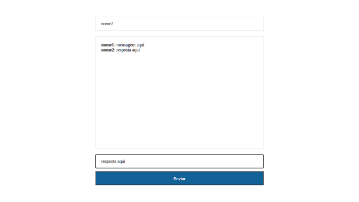

# Bate Papo

> Um bate papo em rede local, envia e recebe mensagens.

Um projeto de bate papo simples, para adquirir conhecimento com socket.io, nodeJs e JavaScript.



## Instalação

```sh
yarn install
```

## Exemplo de uso

Para executar inicie o servidor com yarn start, acesse em seu navegador localhost:3000 .

Outro usuario na mesma rede pode acessar seu bate papo colocando seu ipv4:3000, apos isto escolha um nome para aparecer nas mensagens e digite oque desejar.
